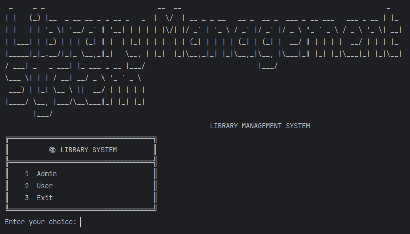
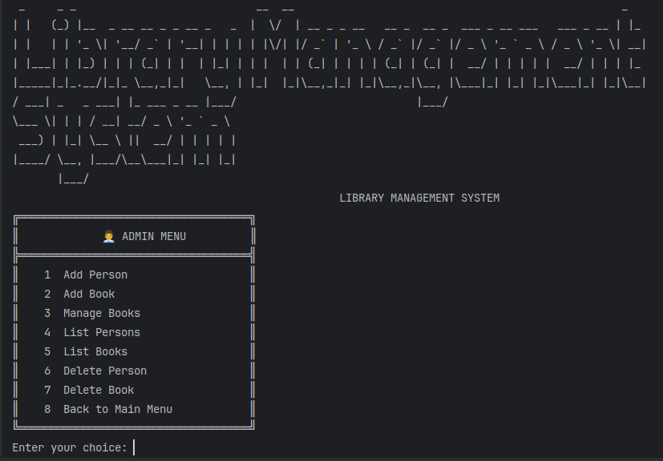
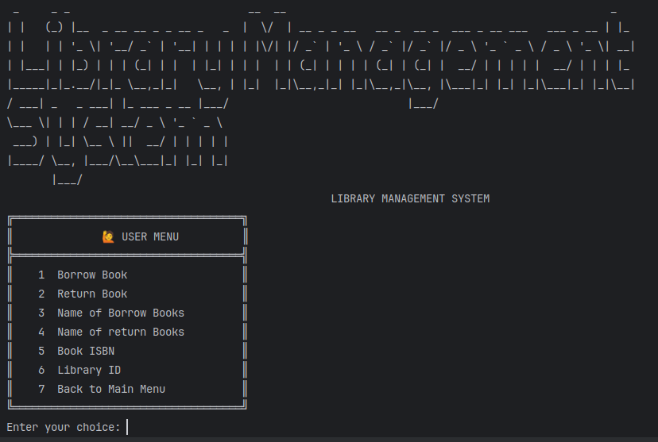

##  Tech Stack


A **modular Library Management System** built using **Java, Spring MVC, Spring JDBC, Spring AOP, JUnit5, Mockito, PostgreSQL, and Maven**—featuring **clean architecture, robust testing, and interactive console routing** for both admin and user operations.  

---

##  Quick Start  

Get the project running in just a few steps:  

```bash
# Clone the repo
git clone git@github.com:Junaid-Ashraf-56/Library_Management_System-Spring-.git
cd Library_Management_System-Spring-

# Build the project
mvn clean install

# Run the application
java -jar target/library-management-system-0.0.1-SNAPSHOT.jar
````

---

##  Table of Contents

* [Features](#features)
* [Tech Stack](#tech-stack)
* [Architecture Overview](#architecture-overview)
* [Screenshots](#screenshots)
* [Installation](#installation)
* [Usage](#usage)
* [Testing](#testing)
* [Console Navigation](#console-navigation)
* [Project Structure](#project-structure)
* [Contributing](#contributing)
* [Acknowledgments](#acknowledgments)

---

##  Features

* **Book Management**: Add, update, delete, and list books.
* **User Management**: Manage library members and librarians.
* **Search**: Find books by title, author, ISBN, or category.
* **Borrow/Return Workflow**: Track checkouts and returns with due dates.
* **Role-Based Access**: Admins manage inventory/users; patrons borrow books.
* **Audit Logging (AOP)**: Automatic logging of key operations.
* **Data Validation**: Ensures integrity (e.g., unique ISBNs, valid logins).

---

##  Clean Architecture
This project is structured following **Clean Architecture** principles, ensuring modularity, maintainability, and clear separation of concerns:
- **Model Layer**  
  Defines core domain entities such as `Book`, `Person`, and `Borrow`.
- **Service Layer**  
  Encapsulates business logic, including borrowing workflows and user registration.
- **Repository Layer**  
  Handles persistence with **Spring JDBC**, ensuring reliable communication with the PostgreSQL database.
- **Controller / UI Layer**  
  Provides console-driven interfaces for both Admin and User operations.


Spring AOP handles **cross-cutting concerns** like logging, ensuring clean and maintainable code.

---

## Screenshots
### Welcome to the Library Management System ###
### Main Menu  
  

### Admin Dashboard  
  

### User Dashboard  
  

---

## Installation

1. **Install prerequisites**: Java (11+), Maven, PostgreSQL.
2. **Database setup**:

   * Create a PostgreSQL database (e.g., `librarydb`).
3. **Build the project**:

   ```bash
   mvn clean install
   ```
---

## Usage

Run the application:

Or run the packaged JAR:

```bash
java -jar target/library-management-system-0.0.1-SNAPSHOT.jar
```

---

## Testing

Run all tests:

```bash
mvn test
```

Run a single test:

```bash
mvn test -Dtest=BookServiceTest
```

---

## Console Navigation

**Admin Menu**

```
1. Add Person  
2. Add Book 
3. Manage Books 
4. List Persons
5. List Books
6. Delete Person
7. Delete Book
8. Logout
```

**User Menu**

```
1. Borrow a Book
2. Return Book
3. View Borrowed Books
4. Search Books
5. Logout
```

---

## 📂 Project Structure

```
LibraryManagementSystem/
├─ src/
│  ├─ main/java/
│  │   ├─ aspect/
│  │   ├─ config/
│  │   ├─ controller/
│  │   ├─ dao/
│  │   ├─ model/
│  │   ├─ service/
│  │   ├─ terminal_ui/
│  │   └─ Main.java
│  ├─ main/resources/
│  └─ test/java/
│      ├─ controller/
│      ├─ dao/
│      ├─ service/
├─ pom.xml
└─ README.md
```

---

## Contributing

Contributions are welcome!

* Fork the repo & create a branch
* Add tests for new features
* Follow coding standards
* Submit a PR with a clear description

---

## Acknowledgments

* **Spring Framework** – for modular development
* **JUnit & Mockito** – for testing support
* **Clean Architecture (Robert C. Martin)** – design inspiration
* **Baeldung** – helpful Spring/JUnit

---
✨ **Thank you for using and contributing to this Library Management System!**
